# Visual Documentation for Financial Dashboard Deployment

## System Architecture Diagram

```mermaid
graph TB
    subgraph "External Layer"
        USER[👤 Users]
        ADMIN[👨‍💼 Admin]
        API_CLIENT[📱 API Clients]
    end
    
    subgraph "Load Balancer"
        NGINX[🌐 Nginx Load Balancer<br/>SSL Termination]
    end
    
    subgraph "Application Layer"
        WEB1[🐳 Django App Instance 1<br/>Financial Dashboard API]
        WEB2[🐳 Django App Instance 2<br/>Financial Dashboard API]
        WEB3[🐳 Django App Instance 3<br/>Financial Dashboard API]
    end
    
    subgraph "Services Layer"
        DASHBOARD[📊 Dashboard Service<br/>Financial Analytics]
        TENANT[🏢 Tenant Service<br/>Multi-tenant Support]
        RBAC[🔐 RBAC Service<br/>Authorization]
        AUDIT[📝 Audit Service<br/>Activity Logging]
    end
    
    subgraph "Data Layer"
        POSTGRES[(🐘 PostgreSQL 17<br/>Primary Database)]
        MEMCACHED[⚡ Memcached<br/>Caching Layer]
        RABBITMQ[🐰 RabbitMQ<br/>Message Queue]
    end
    
    subgraph "Monitoring"
        PROMETHEUS[📈 Prometheus<br/>Metrics Collection]
        GRAFANA[📊 Grafana<br/>Dashboards]
        SENTRY[🚨 Sentry<br/>Error Tracking]
    end
    
    USER --> NGINX
    ADMIN --> NGINX
    API_CLIENT --> NGINX
    
    NGINX --> WEB1
    NGINX --> WEB2
    NGINX --> WEB3
    
    WEB1 --> DASHBOARD
    WEB1 --> TENANT
    WEB1 --> RBAC
    WEB1 --> AUDIT
    
    WEB2 --> DASHBOARD
    WEB2 --> TENANT
    WEB2 --> RBAC
    WEB2 --> AUDIT
    
    WEB3 --> DASHBOARD
    WEB3 --> TENANT
    WEB3 --> RBAC
    WEB3 --> AUDIT
    
    DASHBOARD --> POSTGRES
    DASHBOARD --> MEMCACHED
    TENANT --> POSTGRES
    RBAC --> POSTGRES
    AUDIT --> POSTGRES
    AUDIT --> RABBITMQ
    
    WEB1 --> PROMETHEUS
    WEB2 --> PROMETHEUS
    WEB3 --> PROMETHEUS
    PROMETHEUS --> GRAFANA
    WEB1 --> SENTRY
    WEB2 --> SENTRY
    WEB3 --> SENTRY
```



## CI/CD Pipeline Flow

```mermaid
graph LR
    subgraph "Code Repository"
        GIT[📂 Git Repository<br/>Feature Branch]
    end
    
    subgraph "CI Pipeline"
        LINT[🔍 Code Quality<br/>• Black<br/>• Flake8<br/>• MyPy<br/>• Bandit]
        TEST[🧪 Test Suite<br/>• Unit Tests<br/>• Integration Tests<br/>• Coverage Report]
        BUILD[🏗️ Build Stage<br/>• Multi-arch Images<br/>• Development<br/>• Testing<br/>• Production]
        SECURITY[🛡️ Security Scan<br/>• Vulnerability Check<br/>• Dependency Audit<br/>• Container Scan]
    end
    
    subgraph "Deployment Environments"
        DEV[💻 Development<br/>localhost:8000<br/>Auto Deploy]
        TEST_ENV[🧪 Testing<br/>localhost:8001<br/>Auto Deploy]
        STAGING[🎭 Staging<br/>localhost:8002<br/>Manual Deploy]
        PROD[🚀 Production<br/>Port 80/443<br/>Manual Deploy]
    end
    
    subgraph "Validation"
        HEALTH[❤️ Health Checks]
        MONITOR[📊 Monitoring]
        SMOKE[💨 Smoke Tests]
    end
    
    GIT --> LINT
    LINT --> TEST
    TEST --> BUILD
    BUILD --> SECURITY
    
    SECURITY --> DEV
    DEV --> TEST_ENV
    TEST_ENV --> STAGING
    STAGING --> PROD
    
    DEV --> HEALTH
    TEST_ENV --> HEALTH
    STAGING --> HEALTH
    PROD --> HEALTH
    
    HEALTH --> MONITOR
    HEALTH --> SMOKE
```



## Dashboard Data Flow

```mermaid
sequenceDiagram
    participant Client as 👤 Client
    participant API as 🌐 API Gateway
    participant Auth as 🔐 Auth Service
    participant Dashboard as 📊 Dashboard Service
    participant Cache as ⚡ Cache
    participant DB as 🐘 Database
    
    Client->>API: GET /financial/dashboard
    API->>Auth: Validate Token & Get Tenant Context
    Auth-->>API: Tenant Info (type: user, id: 123)
    
    API->>Dashboard: Get Dashboard Data(tenant)
    Dashboard->>Cache: Check Cache(dashboard:user:123)
    
    alt Cache Hit
        Cache-->>Dashboard: Cached Data
    else Cache Miss
        Dashboard->>DB: Query Accounts(tenant)
        Dashboard->>DB: Query Transactions(tenant)
        Dashboard->>DB: Query Budgets(tenant)
        DB-->>Dashboard: Raw Data
        Dashboard->>Dashboard: Aggregate & Calculate
        Dashboard->>Cache: Store Result(TTL: 10m)
    end
    
    Dashboard-->>API: Dashboard Data
    API-->>Client: JSON Response
```



## Deployment Pipeline States


## Financial Dashboard Components

```mermaid
graph TB
    subgraph "Financial Dashboard API"
        MAIN[📊 /financial/dashboard<br/>Complete Dashboard Data]
        SUMMARY[📈 /financial/dashboard/summary<br/>Financial Summary]
        ACCOUNTS[💳 /financial/dashboard/accounts<br/>Account Summaries]
        TRANSACTIONS[💰 /financial/dashboard/transactions<br/>Transaction Analytics]
        BUDGETS[🎯 /financial/dashboard/budgets<br/>Budget Status]
    end
    
    subgraph "Data Models"
        DASH_DATA[DashboardData<br/>• financial_summary<br/>• account_summaries<br/>• transaction_summary<br/>• budget_statuses<br/>• tenant_info]
        
        FIN_SUMMARY[FinancialSummary<br/>• total_balance<br/>• total_accounts<br/>• active_accounts<br/>• total_transactions<br/>• this_month_amount]
        
        ACC_SUMMARY[AccountSummary<br/>• account_id<br/>• name<br/>• account_type<br/>• balance<br/>• currency]
        
        TXN_SUMMARY[TransactionSummary<br/>• total_transactions<br/>• total_amount<br/>• avg_amount<br/>• recent_transactions]
        
        BUD_STATUS[BudgetStatus<br/>• budget_id<br/>• total_amount<br/>• spent_amount<br/>• percentage_used<br/>• is_over_budget]
    end
    
    subgraph "Business Logic"
        DASH_SERVICE[Dashboard Service<br/>• get_account_summaries()<br/>• get_financial_summary()<br/>• get_transaction_summary()<br/>• get_budget_statuses()<br/>• get_complete_dashboard_data()]
        
        TENANT_SERVICE[Tenant Service<br/>• get_all()<br/>• get_one()<br/>• create()<br/>• update()<br/>• delete()]
    end
    
    subgraph "Data Sources"
        ACCOUNT_MODEL[Account Model<br/>• name, balance<br/>• account_type<br/>• currency, is_active]
        
        TRANSACTION_MODEL[Transaction Model<br/>• amount, currency<br/>• transaction_type<br/>• status, category]
        
        BUDGET_MODEL[Budget Model<br/>• total_amount<br/>• spent_amount<br/>• start_date, end_date]
    end
    
    MAIN --> DASH_DATA
    SUMMARY --> FIN_SUMMARY
    ACCOUNTS --> ACC_SUMMARY
    TRANSACTIONS --> TXN_SUMMARY
    BUDGETS --> BUD_STATUS
    
    DASH_DATA --> DASH_SERVICE
    FIN_SUMMARY --> DASH_SERVICE
    ACC_SUMMARY --> DASH_SERVICE
    TXN_SUMMARY --> DASH_SERVICE
    BUD_STATUS --> DASH_SERVICE
    
    DASH_SERVICE --> TENANT_SERVICE
    TENANT_SERVICE --> ACCOUNT_MODEL
    TENANT_SERVICE --> TRANSACTION_MODEL
    TENANT_SERVICE --> BUDGET_MODEL
```

## Environment Architecture

```mermaid
graph TB
    subgraph "Development Environment"
        DEV_WEB[🐳 Django App<br/>DEBUG=True<br/>Port: 8000]
        DEV_DB[(🐘 PostgreSQL<br/>Sample Data)]
        DEV_CACHE[⚡ Memcached<br/>Short TTL]
        DEV_TOOLS[🛠️ Dev Tools<br/>• Adminer<br/>• Mailhog<br/>• Hot Reload]
        
        DEV_WEB --> DEV_DB
        DEV_WEB --> DEV_CACHE
        DEV_WEB --> DEV_TOOLS
    end
    
    subgraph "Testing Environment"
        TEST_WEB[🐳 Django App<br/>TESTING=True<br/>Port: 8001]
        TEST_DB[(🐘 PostgreSQL<br/>Tmpfs Storage)]
        TEST_CACHE[⚡ Memcached<br/>Test Config]
        TEST_RABBIT[🐰 RabbitMQ<br/>Test Queues]
        
        TEST_WEB --> TEST_DB
        TEST_WEB --> TEST_CACHE
        TEST_WEB --> TEST_RABBIT
    end
    
    subgraph "Staging Environment"
        STAGE_LB[🌐 Nginx<br/>Load Balancer]
        STAGE_WEB1[🐳 Django App 1]
        STAGE_WEB2[🐳 Django App 2]
        STAGE_DB[(🐘 PostgreSQL<br/>Staging Data)]
        STAGE_CACHE[⚡ Memcached<br/>Production Config]
        
        STAGE_LB --> STAGE_WEB1
        STAGE_LB --> STAGE_WEB2
        STAGE_WEB1 --> STAGE_DB
        STAGE_WEB2 --> STAGE_DB
        STAGE_WEB1 --> STAGE_CACHE
        STAGE_WEB2 --> STAGE_CACHE
    end
    
    subgraph "Production Environment"
        PROD_LB[🌐 Nginx<br/>SSL + Load Balancer<br/>Port: 80/443]
        PROD_WEB1[🐳 Django App 1<br/>Resource Limits]
        PROD_WEB2[🐳 Django App 2<br/>Resource Limits]
        PROD_WEB3[🐳 Django App 3<br/>Resource Limits]
        PROD_DB[(🐘 PostgreSQL<br/>Production Data<br/>Backups)]
        PROD_CACHE[⚡ Memcached<br/>High Availability]
        PROD_MONITOR[📊 Monitoring<br/>• Prometheus<br/>• Grafana<br/>• Sentry]
        
        PROD_LB --> PROD_WEB1
        PROD_LB --> PROD_WEB2
        PROD_LB --> PROD_WEB3
        PROD_WEB1 --> PROD_DB
        PROD_WEB2 --> PROD_DB
        PROD_WEB3 --> PROD_DB
        PROD_WEB1 --> PROD_CACHE
        PROD_WEB2 --> PROD_CACHE
        PROD_WEB3 --> PROD_CACHE
        PROD_WEB1 --> PROD_MONITOR
        PROD_WEB2 --> PROD_MONITOR
        PROD_WEB3 --> PROD_MONITOR
    end
```



## Monitoring Dashboard

```mermaid
graph TB
    subgraph "Application Metrics"
        REQ_RATE[📊 Request Rate<br/>requests/second]
        RESP_TIME[⏱️ Response Time<br/>95th percentile]
        ERROR_RATE[❌ Error Rate<br/>percentage]
        CACHE_HIT[⚡ Cache Hit Ratio<br/>percentage]
    end
    
    subgraph "Infrastructure Metrics"
        CPU_USAGE[💻 CPU Usage<br/>percentage]
        MEM_USAGE[🧠 Memory Usage<br/>percentage]
        DISK_USAGE[💾 Disk Usage<br/>percentage]
        NET_IO[🌐 Network I/O<br/>bytes/second]
    end
    
    subgraph "Database Metrics"
        DB_CONN[🔗 DB Connections<br/>active/total]
        QUERY_TIME[🐌 Slow Queries<br/>count/duration]
        DB_SIZE[📏 Database Size<br/>GB]
        LOCK_WAIT[🔒 Lock Waits<br/>count/duration]
    end
    
    subgraph "Business Metrics"
        ACTIVE_USERS[👥 Active Users<br/>count]
        DASH_USAGE[📊 Dashboard Usage<br/>views/day]
        API_CALLS[📞 API Calls<br/>calls/minute]
        TENANT_COUNT[🏢 Active Tenants<br/>count]
    end
    
    subgraph "Alerts"
        HIGH_ERROR[🚨 High Error Rate<br/>> 1%]
        SLOW_RESP[⏰ Slow Response<br/>> 500ms]
        LOW_CACHE[❄️ Low Cache Hit<br/>< 70%]
        HIGH_CPU[🔥 High CPU<br/>> 80%]
    end
    
    REQ_RATE --> HIGH_ERROR
    RESP_TIME --> SLOW_RESP
    CACHE_HIT --> LOW_CACHE
    CPU_USAGE --> HIGH_CPU
```



## Deployment Validation Checklist

| ✅ Check | Description | Command | Expected Result |
|---------|-------------|---------|-----------------|
| Health Check | Service health status | `curl /health` | `{"status": "healthy"}` |
| Dashboard API | Dashboard functionality | `curl /financial/dashboard` | Valid JSON response |
| Database | Database connectivity | `python manage.py dbshell` | Connection established |
| Cache | Cache functionality | `telnet memcached 11211` | Connected to Memcached |
| Authentication | Auth system | `curl -H "Authorization: Bearer token"` | Valid token accepted |
| Performance | Response times | `ab -n 100 -c 10 /dashboard` | < 200ms average |
| Security | SSL/TLS | `curl -I https://domain.com` | HTTPS working |
| Monitoring | Metrics collection | Check Prometheus targets | All targets UP |
| Logs | Log aggregation | `docker compose logs` | Logs flowing |
| Rollback | Rollback capability | `./scripts/rollback-test.sh` | Rollback successful |

---

## Command Reference Quick Guide

### Development Commands
```bash
# Start development environment
docker compose -f docker-compose.development.yml up -d

# View dashboard
curl http://localhost:8000/financial/dashboard

# Check logs
docker compose logs web -f
```

### Testing Commands
```bash
# Run tests
pytest tests/unit/test_dashboard.py -v

# Performance test
ab -n 1000 -c 10 http://localhost:8001/financial/dashboard

# Load test
./scripts/load-test-dashboard.sh
```

### Production Commands
```bash
# Deploy to production
./ci/deploy.sh production

# Health check
./monitoring/health-check.sh production

# Rollback if needed
./ci/scripts/emergency-rollback.sh production
```

### Monitoring Commands
```bash
# Check metrics
curl http://localhost:9090/metrics

# View dashboards
open http://localhost:3000/dashboards

# Check alerts
./monitoring/check-alerts.sh
```

This visual documentation complements the comprehensive deployment guide and provides clear diagrams for understanding the system architecture, data flow, and deployment process.